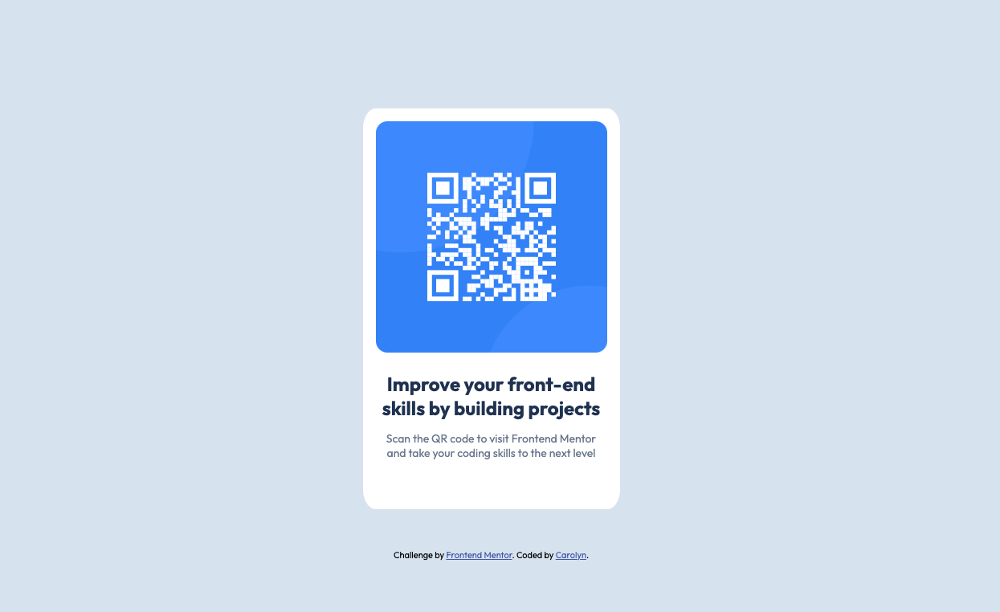

# Frontend Mentor - QR code component solution

This is a solution to the [QR code component challenge on Frontend Mentor](https://www.frontendmentor.io/challenges/qr-code-component-iux_sIO_H). Frontend Mentor challenges help you improve your coding skills by building realistic projects. 

## Table of contents

- [Overview](#overview)
  - [Screenshot](#screenshot)
  - [Links](#links)
- [My process](#my-process)
  - [Built with](#built-with)
  - [What I learned](#what-i-learned)
  - [Continued development](#continued-development)
- [Author](#author)

## Overview

### Screenshot

### Links

- Solution URL: [https://github.com/carolyn-lm/qr-code-challenge]
- Live Site URL: [https://carolyn-lm.github.io/qr-code-challenge/]

### Built with

- Semantic HTML5 markup
- CSS custom properties
- Flexbox

### What I learned
Helped me get a little more practice with spacing and flexbox.

### Continued development

I still need to work on understanding flexbox better and when to use margin vs padding. I am also still not totally comfortable with sizing of images.

## Author
Carolyn M.
- Frontend Mentor - [https://www.frontendmentor.io/profile/carolyn-lm]

